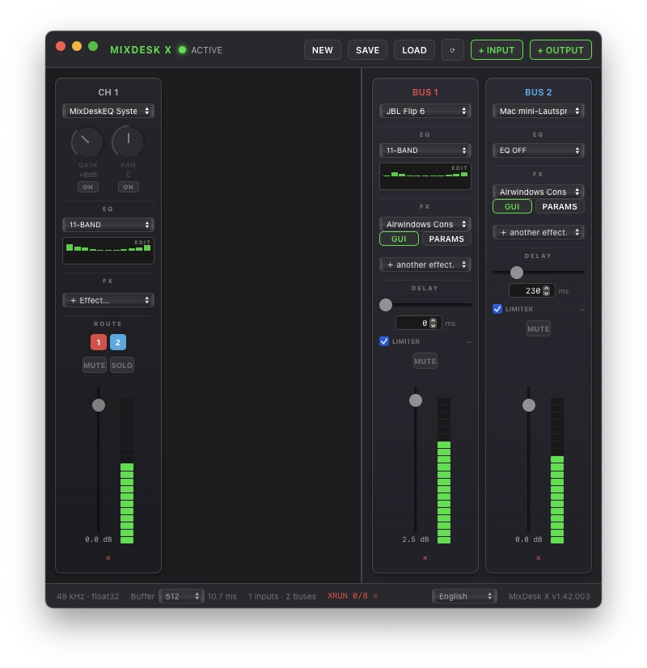

# MixDesk X

**Free multi-device audio mixer & router for macOS and Windows.**
Route any input to any output, EQ everything, sync your Bluetooth speakers, and chain studio-grade effects — in a lightweight tray app.

## Download

**[⬇ Latest release](../../releases/latest)** — free, no account, no ads.

| Platform | File |
|---|---|
| macOS (Apple Silicon) | `MixDesk-X-x.xx.xxx.dmg` — signed & notarized |
| Windows 10/11 x64 | `MixDesk-X-x.xx.xxx-amd64-installer.exe` — signed |
| Windows 11 ARM64 | `MixDesk-X-x.xx.xxx-arm64-installer.exe` — signed |

Linux? Maybe later — the engine is portable. Open an issue if you want it.

## What it does

Think of it as a compact Mackie-style console between all your audio devices:

- **Inputs → Buses, any combination.** Add any capture device (USB mic, webcam mic, interface, loopback/virtual cable) as an input strip and route it to up to 4 output buses.
- **Per-input strip:** Gain and Pan (switchable in/out of the signal path), 2/3/11-band EQ with graphic editor, CLAP effect chain, Mute/Solo, fader, VU meter.
- **Per-bus strip:** its own output device, EQ, CLAP effect chain, **delay 0–1000 ms**, transparent safety limiter with gain-reduction meter, fader, VU.
- **Speaker sync:** the per-bus delay lets you align a Bluetooth speaker with wired speakers playing the same source — multi-room without the echo.
- **CLAP plugin host:** stack multiple effects per strip (each slot its own instance), open the plugin's **native GUI**, or use the built-in generic parameter editor. One click installs the free [Airwindows Consolidated](https://github.com/baconpaul/airwin2rack) pack (~400 effects).
- **Mic processing for calls & streams:** EQ/compress your USB or webcam mic and feed it to Discord, Zoom, or OBS through a virtual device — see [Virtual audio devices](#virtual-audio-devices) below.
- **Presets:** save/load complete mixer setups; the last preset loads automatically at startup.
- **Stays out of your way:** tray/menu-bar app, compact mini mixer (macOS), XRUN monitor in the footer, automatic stream recovery when devices disappear or glitch.
- **Low latency:** buffer size selectable 128–2048 frames, 44.1/48/96 kHz, float32 engine end to end.

## Quick start

1. Install and launch — MixDesk X lives in your tray / menu bar.
2. **+ INPUT** → pick your source (mic, loopback device, virtual cable).
3. **+ OUTPUT** → pick where it should go (speakers, headphones, virtual cable).
4. Click the bus numbers on the input strip to route it. Done — now add EQ, effects, delay to taste.

### Example: EQ'd mic into Discord (Windows)

1. Install [VB-Audio Virtual Cable](https://vb-audio.com/Cable/) (free).
2. Input strip: your USB/webcam mic → EQ + effects.
3. Output bus: device = **CABLE Input**.
4. Discord → Voice settings → Input device = **CABLE Output**.

On macOS use the [MixDeskEQ audio driver](https://github.com/adelvo-software/mde-audio-drivers) or [BlackHole](https://github.com/ExistentialAudio/BlackHole) the same way.

## Virtual audio devices

MixDesk X routes between real devices out of the box. For app-to-app routing (mic → Discord, system audio → MixDesk X) you need a free virtual device once:

| OS | Driver | Notes |
|---|---|---|
| macOS | **[Adelvo audio drivers](https://github.com/adelvo-software/mde-audio-drivers)** | Recommended — an installer built on the excellent open-source [BlackHole](https://github.com/ExistentialAudio/BlackHole) (GPL-3.0) that sets up **multiple** stereo loopback devices in one go. Plain BlackHole gives you a single stereo device; multi-bus routing usually needs two or more. The built-in **“System audio via driver”** input option auto-routes your system output through it, one click. |
| macOS | [BlackHole 2ch](https://github.com/ExistentialAudio/BlackHole) | The underlying loopback driver — fine if one stereo loop is all you need. |
| Windows | [VB-Audio Virtual Cable](https://vb-audio.com/Cable/) | Free version = **one** cable (enough for mic → Discord). CABLE Input = MixDesk X output bus, CABLE Output = mic in Discord/OBS. |
| Windows | [VB-Cable A+B / C+D](https://vb-audio.com/Cable/) or [VoiceMeeter](https://vb-audio.com/Voicemeeter/) | Need more loops? A+B/C+D are donationware add-on cables; VoiceMeeter (free) also adds multiple virtual devices. VB-Audio's license does not allow bundling, so these are separate installs. |

## Requirements

- **macOS 13+** (Apple Silicon)
- **Windows 10/11** (x64 or ARM64)
- CLAP plugins are optional; scanned from the standard CLAP folders

## License

MixDesk X is **freeware** (binary distribution, closed source) — free for personal and commercial use. See [EULA.md](EULA.md). CLAP plugins are third-party software under their own licenses.

---

Made by [Adelvo](https://adelvo.io) — also the home of **Directors Plan for vMix** (rundown & show control), **MixDeskEQ** (system-wide EQ driver for macOS) and **LLT / Adelvo Translator Bridge** (live translation tools).
